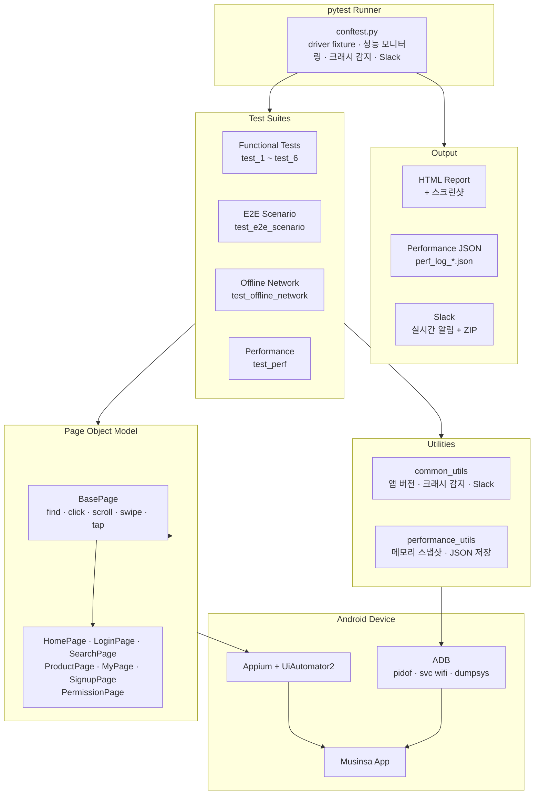

# Musinsa App Test Automation

[](#)
[](#)
[](#)
[](#)
[](#)

Python + Appium 기반의 **무신사 Android 앱 테스트 자동화 프레임워크**입니다.  
Page Object Model(POM) 패턴을 적용하고, 기능 테스트뿐 아니라 **비기능 테스트**(오프라인 네트워크, 성능/메모리, 크래시 감지)를 포함합니다.

---

## What This Project Demonstrates

| Skill | How It's Demonstrated |
|-------|----------------------|
| **Design Pattern** | Page Object Model — BasePage 상속 구조, 로케이터 분리, 재사용 가능한 액션 메서드 |
| **Functional Testing** | 로그인, 회원가입, 검색, 즐겨찾기, 로그아웃 등 주요 사용자 시나리오 검증 |
| **Non-Functional Testing** | 오프라인 네트워크 크래시 검증, 콜드/웜 스타트 성능 측정, 메모리 누수 모니터링 |
| **E2E Integration** | 단일 세션에서 전체 사용자 여정을 순차 실행하며 메모리 누적 추이 관찰 |
| **Crash Detection** | ADB `pidof`로 앱 프로세스 생존 여부 실시간 확인 |
| **Reporting** | pytest-html 리포트 + 실패 시 스크린샷 자동 첨부 + Slack 실시간 알림 |
| **Execution** | 로컬 Android 디바이스 기반 실행 (Shell Script 자동화) |

---

## Architecture

### System Architecture



---

## Test Suites

모든 테스트는 **무신사 Android 앱** (com.musinsa.store)을 대상으로 실행됩니다.

### Functional Tests — 개별 기능 검증

| # | 테스트 파일 | 시나리오 | 검증 항목 |
|---|-----------|---------|----------|
| 1 | `test_1_login_fail.py` | 로그인 실패 | 잘못된 자격증명 → 에러 팝업 노출 |
| 2 | `test_2_signup.py` | 회원가입 | 약관 동의 → 문자 본인 인증 화면 진입 |
| 3 | `test_3_kakao_login.py` | 카카오 로그인 | OAuth 로그인 → 홈 화면 정상 진입 |
| 4 | `test_4_search.py` | 상품 검색 | 키워드 검색 → 스크롤 → 상품 상세 진입 |
| 5 | `test_5_favorites.py` | 즐겨찾기 | 좋아요 추가 → 즐겨찾기 탭 확인 |
| 6 | `test_6_my_page.py` | 로그아웃 | 마이페이지 스크롤 → 로그아웃 완료 |

**Pattern**: Page Object Model | **Scope**: function (테스트마다 독립 세션)

### E2E Integration — 통합 시나리오

```
tests/test_e2e_scenario.py
├── test_e2e_01_launch_and_permission    → 앱 실행 및 권한 처리
├── test_e2e_02_login_fail               → 로그인 실패
├── test_e2e_03_signup_flow              → 회원가입 플로우
├── test_e2e_04_kakao_login              → 카카오 로그인
├── test_e2e_05_search_product           → 상품 검색
├── test_e2e_06_add_favorite             → 좋아요 추가
├── test_e2e_07_my_page_scroll           → 마이페이지 스크롤
└── test_e2e_08_logout                   → 로그아웃
```

**Scope**: module (단일 세션 공유 — 메모리 누적 추이 관찰)

### Non-Functional Tests — 오프라인 네트워크

| 테스트 | 방법 | 검증 항목 |
|--------|------|----------|
| 온라인 기준선 | 정상 상태 확인 | 홈 화면 로드 |
| 오프라인 홈 탭 | `adb shell svc wifi/data disable` | 앱 크래시 없음 (PID 생존) |
| 오프라인 마이 탭 | 탭 전환 | 크래시 없음 |
| 오프라인 스크롤 | 3회 스크롤 | 크래시 없음 |
| 네트워크 복구 | `adb shell svc wifi/data enable` | 콘텐츠 자동 복구 |
| 오프라인 콜드 스타트 | 강제 종료 → 재시작 | 크래시 없음 |

### Non-Functional Tests — 성능

| 측정 항목 | 방법 | 반복 | 임계치 |
|----------|------|------|--------|
| 콜드 스타트 | `am force-stop` → `am start` → 렌더링 대기 | 3회 | < 10초 |
| 웜 스타트 | 백그라운드 → 복귀 | 3회 | < 5초 |
| 메모리 사용량 | `get_performance_data` (화면별 측정) | 화면 3개 | < 500MB |

---

## Project Structure

```
musinsa_automation/
├── pages/                      # Page Object Model (BasePage + 7 page classes)
├── tests/                      # Functional · E2E · Offline · Performance
├── utils/                      # 크래시 감지, 메모리 스냅샷, Slack
├── reports/                    # 리포트 자동 생성
├── run_tests.sh                # 기능 테스트 실행
├── run_nonfunctional_tests.sh  # 비기능 테스트 실행
├── requirements.txt
└── .env.example
```

---

## Running Locally

### Prerequisites

| Tool | Verify | Purpose |
|------|--------|---------|
| Python 3.12+ | `python --version` | 테스트 실행 |
| Appium 2.x | `appium --version` | 모바일 자동화 서버 |
| Android SDK | `adb --version` | 디바이스 제어 |
| Android Device/Emulator | `adb devices` | 테스트 대상 |

### Installation

```bash
# Clone
git clone https://github.com/guswns98/musinsa-automation.git
cd musinsa-automation

# Install dependencies
pip install -r requirements.txt

# Environment setup
cp .env.example .env
# .env 파일에 SLACK_BOT_TOKEN 설정 (선택)
```

### Running Tests

```bash
# Appium 서버 시작
appium &

# 기능 테스트
./run_tests.sh

# 비기능 테스트 (오프라인 + 성능)
./run_nonfunctional_tests.sh

# E2E 시나리오
pytest tests/test_e2e_scenario.py -v --html=reports/e2e_report.html

# 개별 테스트
pytest tests/test_1_login_fail.py -v

# Slack 연동
pytest tests/ -v \
    --slack_webhook="https://hooks.slack.com/services/xxx" \
    --slack_channel="#qa-automation"
```

---

## Reports

테스트 실행 후 `reports/` 디렉터리에 타임스탬프 폴더로 자동 생성됩니다.

| 리포트 | 형식 | 내용 |
|--------|------|------|
| HTML Report | `report.html` | 테스트 결과 + 실패 시 스크린샷 자동 첨부 |
| Performance Log | `perf_log_*.json` | 테스트별 메모리 사용량 (before/after/diff) |
| Cold Start | `perf_cold_start.json` | 콜드 스타트 시간 (3회 측정) |
| Warm Start | `perf_warm_start.json` | 웜 스타트 시간 (3회 측정) |
| Memory Usage | `perf_memory_usage.json` | 화면별 메모리 스냅샷 |

Slack 연동 시 테스트별 실시간 알림 + 세션 완료 시 ZIP 리포트 자동 업로드

---

## Tech Stack

| Category | Technologies |
|----------|-------------|
| **Mobile Automation** | Appium 2.x, UiAutomator2 |
| **Test Framework** | pytest, pytest-html, pytest-json-report |
| **Language** | Python 3.12+ |
| **Design Pattern** | Page Object Model (POM) |
| **Device Control** | ADB (크래시 감지, 네트워크 제어, 성능 측정) |
| **Reporting** | pytest-html (스크린샷 첨부), JSON 성능 로그 |
| **Notification** | Slack API (Bot Token + Webhook) |
| **Execution** | Shell Script (run_tests.sh, run_nonfunctional_tests.sh) |

---

## Demo

[데모 영상 보기](https://www.youtube.com/shorts/B9G32050-IM)
